# Objetivo
Criar uma VPC com com 2 sub-redes públicas e 2 privadas, uma instância EC2 com script userdata para instalar e configurar o servidor Nginx junto de uma página estática criada usando html e css, um serviço sytemd para verificar a disponibilidade do site a cada 30 segundos e um script bash configurado para enviar notificações ao Discord, graças à integração com um webhook, caso a aplicação não esteja disponível.

# Índice
- [Infraestrutura](#criação-da-infraestrutura)
- [Instância EC2](#criação-da-instância)
- [Script de bootstrap](#script-de-bootstrap-user-data)

# Criação da Infraestrutura

### VPC (Virtual Private Cloud)
Acesse o Console de Gerenciamento da AWS > VPC > Your VPCs > Create VPC.

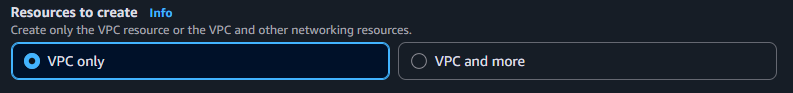

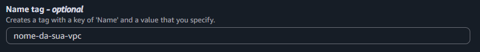
  
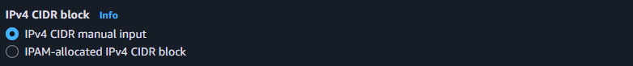

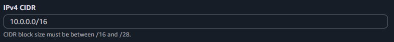
> Deixe todas as outras opções como padrão

### Internet Gateway
No painel esquerdo, clique em Internet Gateways > Create internet gateway.

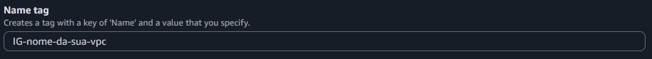

Selecione o Internet Gateway criado > clique em Actions > Attach to VPC > selecione a VPC criada.

### Sub-rede Pública
No painel esquerdo, clique em Subnets > Create subnet > selecione a VPC criada.

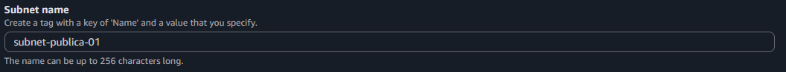

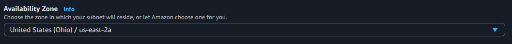

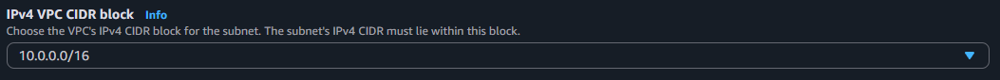

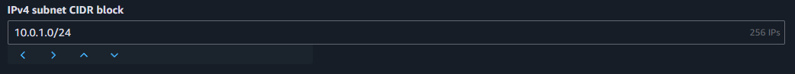

> Repita o processo para criar a segunda sub-rede alterando apenas o IPv4 Subnet CIDR Block (ex. 10.0.**2**.0/24)

### Sub-rede Privada

> Repita o processo anterior alterando apenas o nome da subrede (ex. subnet-**privada**-01)

### Route Table Pública
No painel esquerdo, clique em Route Tables > clique em Create route table.

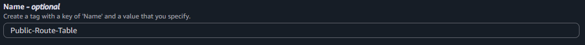

Selecione a tabela criada, clique em Edit routes e crie uma nova rota com as informações a seguir:

Na aba Subnet associations, clique em Edit subnet associations > selecione a(s) sub-rede(s) pública(s)

### Route Table Privada

> Repita o processo anterior alterando apenas o nome da tabela de rota (ex. **Private**-Route-Table") e associando à(s) sub-rede(s) privada(s)

### Security Group
No Console AWS, vá para EC2 > Security Groups > Create Security Group.

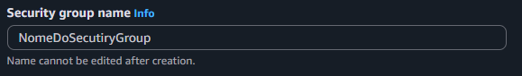

Agora adcione Regras de Entrada (Inbound Rules) para permitir tráfego HTTP e SSH (opcional).

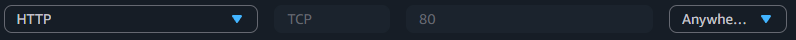
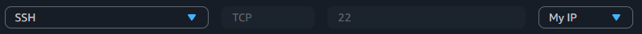

# Criação da Instância
No Console AWS, vá para EC2 > Instances > Launch Instances.

Crie as seguintes tags e preencha com as informações do seu projeto:

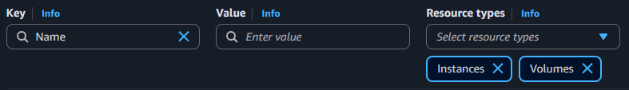 
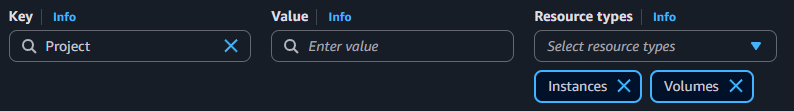 
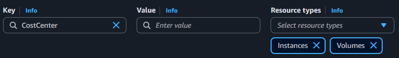 

Selecione uma imagem (AMI) Linux e uma versão LTS

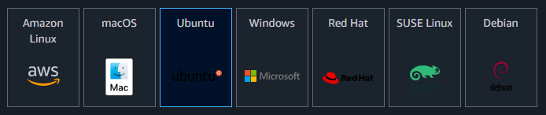

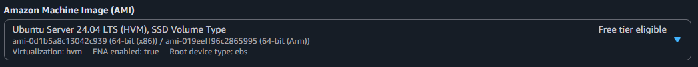

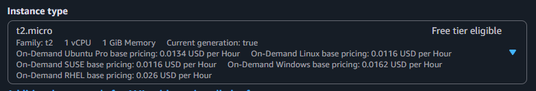

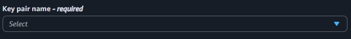
> Caso não tenha uma key pair, crie e armazene em C:\Users\seu_usuário\\.ssh

Em Network Settings, clique em edit no canto superior direito > selecione a sua VPC e altere para a sub-rede pública de sua preferência:

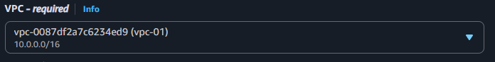

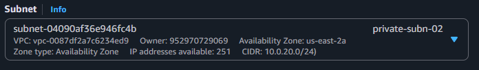

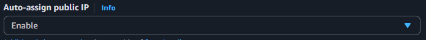

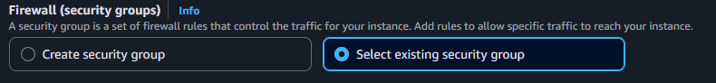

# Script de bootstrap (user-data)

>Para prosseguir faça o download do arquivo [init.sh](scripts/init.sh)

Na seção "Advanced Details", localize o campo "User data" > Choose file > selecione o arquivo init.sh:

⚠️ **Nota:** Lembre de alterar a variável DISCORD_WEBHOOK="LINK_DO_SEU_WEEBHOOK"!
